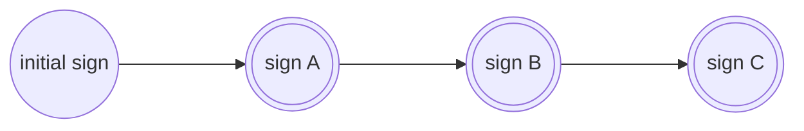

# **DEVELOPER DOCUMENTATION** 
---


## Table of Contents
1. [Introduction](#introduction)
      - [Project Overview](#project-overview)
      - [Technologies Used](#technologies-used)
      - [Architecture Plan](#architecture-plan)
      - [Transition Design overview](#transition-design-overview)
2. [Installation and Setup](#installation-and-setup)
      - [System Requirements](#system-requirements)
      - [Installation Steps](#installation-steps)
      - [Configuration](#configuration)
3. [Project Structure](#project-structure)
      - [Folder Structure](#folder-structure)
      - [Key Files and Modules](#key-files-and-modules)
4. [Database Design](#database-design)
      - [Entity-Relationship Diagram (ERD)](#entity-relationship-diagram-erd)
      - [Database Schema](#database-schema)
      - [Indexing techniques](#indexing-technique)
5. [APIs and Endpoints](#apis-and-endpoints)
      - [API Documentation](#api-documentation)
      - [Request/Response Examples](#requestresponse-examples)
6. [Authentication and Authorization](#authentication-and-authorization)
      - [User Management](#user-management)
      - [Access Control](#access-control)
      - [Token-based Authentication](#token-based-authentication)
7. [Data Processing and Calculation](#data-processing-and-calculation)
      - [Dashboard data](#dashboard-data)
      - [Calculation Methods and Formula](#calculation-methods-and-formulas)
8. [External Integrations](#third-party-integrations)
      - [External Service Configuration](#external-service-configuration)
9. [Testing](#testing)
      - [Unit Tests](#unit-tests)
      - [Test Data and Fixtures](#test-data-and-fixtures)
10. [Deployment](#deployment)
      - [Serverless Configuration](#serverless-configuration)
      - [Server Configuration](#server-configuration)
11. [Performance Optimization](#performance-optimization)
      - [Caching Strategies](#caching-strategies)
      - [Database Query Optimization](#database-query-optimization)
      - [Asynchronous Tasks](#asynchronous-tasks)
12. [Security and Privacy](#security-and-privacy)
      - [Data Encryption](#data-encryption)
      - [Secure coding practices](#secure-coding-practices)
13. [Glossary](#glossary)
      - [Key terms](#key-terms)
14. [Multi-Tenancy Support](#multi-tenancy support)
15. [Versionsing](#versioning)
      - [Version Management](#version-management)
      - [Change log](#change-log)
16. [Troubleshooting Guide](#troubleshooting-guide)
      - [Common Issues and Solutions](#common-issues-and-solutions)
      - [Debugging Techniques](#debugging-techniques)
17. [Support and Contact Information](#troubleshooting)
      - [Developer and Maintainer ](#developer-and-maintainer )
      - [Support](#support)
      - [Contact](#contact)
18. [Licensing Information](#licensing-information)
      - [License Agreement](#license-agreement)

## **INTRODUCTION**
---
### Project Overview
**krediq**  - An one step  web-based invoice discounting platform  designed to simplify and optimize the process of invoice discounting for your businesses . With the aim of providing seamless financial solutions, krediq streamlines the complex process of invoice discounting, empowering SME's to unlock their working capital growth.

### Technologies Used
The following technologies and tools were used in the development of krediq :

- Django (version 4.2.5)
- Python (version 3.12.1)
- Django Rest Framework (version 3.2.5)
- Pandas (version 2.0.2)
- Django Channels (version 4.0.0)


### Architecture Plan
- The Application is build based on greenfield deployment model and further gets utilizes with blue-green model for forward stages .
- Design patterns are effectively utilized in-order to meet enterprise software experience .
- The project is well refactored with pep guidelines  and architectured with the following criteria:

      - **W**ebsocket **B**ased **A**rchitecture (WBA)
      - **M**essage **O**riented **M**iddleware (MOA)
      - **E**vent **D**riven **A**rchitecture (EDA)
      - **R**epresentational **S**tate **T**ransfer (REST)

### Transition Design overview 
- Consider an program contract with action of **SUBMIT** , the program starts with an lifcycle of initial sign moves to sign A , B and C so far .
- when the user configured the required number of signs in their admin panel , the algorithm automatically sets the last sign and applies further execution of code .
- The last sign values are captured using **observer design pattern** in simple django signals . 


???+ Warning

    - The signals works only for administrator and supervisor user . 




## **INSTALLATION AND SETUP**
---
### System Requirements
Before you proceed with the installation of **krediq**, make sure your system meets the following requirements:

- **Operating System:** Windows 10, macOS Big Sur, or a Linux distribution (Ubuntu 20.04 recommended).
- **Processor:** Dual-core processor with a clock speed of 2.0 GHz or higher.
- **Memory (RAM):** Minimum 4 GB RAM, 8 GB recommended for optimal performance.
- **Storage:** At least 20 GB of available disk space for the application and database.
- **Web Browser:** Latest version of Google Chrome, Mozilla Firefox, or Microsoft Edge.
- **Python:** Version 3.10 or higher.
- **Virtual Environment (recommended):** Virtual environment tool such as `virtualenv` or `conda` for managing Python dependencies.


### Installation Steps
To install and set up krediq, follow these steps:
```
- pip install -r requirements.txt
- DJANGO_SETTINGS_MODDULE = krediq.settings 
- python manage.py migrate
- python manage.py migrate --run-syncdb
- python manage.py collectstatic
- python manage.py runserver
```

### Configuration

- **Database**
      - `DB_ENGINE`
      - `DB_NAME`
      - `DB_USER`
      - `DB_PASSWORD`
      - `DB_HOST`
  
- **Email** 
      - `EMAIL_HOST`
      - `EMAIL_ID`
      - `EMAIL_PASSWORD`
      - `EMAIL_BACKEND`
      - `EMAIL_PORT`

- **SMS** 
      - `TXT_LOCL_KEY`
      - `TXT_LOCL_SNDR`

- **Production**
      - `CSRF_HOSTS`
      - `DEV`
      - `TEST`
      - `DISABLE_COLLECTSTATIC`
- **Url**
      - `FINANCE_MODULE`
      - `FINANCE_MODULE_TOKEN`
      - `ONBOARDING_LINK`
      - `LOGIN_LINK`

- **Support**
      - `HELP_EMAIL`
      - `SUPPORT_EMAIL`

- **Celery**
      - `CELERY_URL`
      - `CELERY_SSL`

- **Redis**
      - `REDIS_URL`
      - `REDIS_HOST`
      - `REDIS_PASSWORD`

- **Storage**
      - `STORAGE_ACCESS_KEY`
      - `STORAGE_ACCESS_ID`
      - `STORAGE_BUCKET_NAME`
      - `STORAGE_ENDPOINT_URL`

- **Cache**
      - `CACHE_LOCATION`
      - `MEMCACHE_USERNAME`
      - `MEMCACHE_PASSWORD`

- **Others**
      - `SECRET_KEY`
      - `MESSAGE_PAGE_SIZE`
      - `DISABLE_COLLECTSTATIC`

- **Session**
      - `SESSION_COOKIE_AGE`
      - `SESSION_SAVE_EVERY_REQUEST`

- **HSTS**
      - `SECURE_HSTS_SECONDS`
      - `SECURE_SSL_REDIRECT`


## **PROJECT STRUCTURE**
---
### Folder Structure

-  **`/accounts`**: **This directory contains the main configuration code for authentication , authorization and onboarding information.**

      - ***`/api`***: Houses of api for party , kyc , remittance ,currency , country and users .

      - ***`/serializers`***: Contains the serializers for all accoutns models.

      - ***`/views`***: holds the base api for currency , country etc., 

      - ***`/models`***: holds the database schema for the accounts

      - ***`/path`***: Contains all the url for accounts .
      - ***`/migrations`***: Holds the migrations folder for the accounts app .


- **`/transaction`**: **This directory contains the main application code for all transactional process .**
      - ***`/api`***: Houses the API-related code for program , counterparty, pairing , action status , invoice , finance request , finance repayment , transaction authorization.

      - ***`/serializers`***: Contains the serializers for invoice , program , counterparty , invoice , finance request and repayments .

      - ***`/models`***: holds the database schema for the transaction.

      - ***`/path`***: Contains all the url for transaction .

      - ***`/migrations`***: Holds the migrations folder for the transaction app .


- **`/utils`**: **This directory contains the utility functions and action that required .**
      - ***`/app`***: Houses for app level configuration include admin form , custom form , models manager , localization , class cache .

      - ***`/authorization`***: Contains the jwt auth settings , custom  permissions , custom authentication .

      - ***`/enum`***: Contains all the common and scheme based enum and choices 

      - ***`/exception`***: Holds all the custom exception for api level and serializers level . 

      - ***`/file`***: Holds all the image / document storage path and validation. 

      - ***`/helpers`***: Holds the queries , common functionality , results , hashing and validations .

      - ***`/middlewares`***: Contains all the custom middlewares for the app on start for ip whitelist , websocket soft disconnect , session management , token expiration , otp clearing , asgi and wsgi config's , heartbeart for socket , socket authentication , login attempts .

      - ***`/response`***: Holds base api response for 200 , 203 , 404 status codes with custom error response enum . 


- **`/services`**: **This directory maintains the cron jobs , observers  and signals .**

      - ***`/workers`***: contains the finance request and repayment managements 

      - ***`/signals`***: observer design pattern model based on django signal for all last sign transaction .

      - ***`/socket`***: web socket configuration for messages , dashboard , menu status  and pending invoices .

 

- **`/search`**: **This directory maintains the search functionality .**

      - ***`/graphql`***: graphql queries for transaction models includes finflo models and krediq schemas.

      - ***`/elasticsearch`***: elasticsearch search modules for transaction .

  


- **`/fixtures`**: Common and scenario data to be loaded to db.
- **`/static`**: Static files such as stylesheets, JavaScript, and images.
- **`/templates`**: HTML templates used to render the web pages.
- **`/tests`**: Unit and integration tests for the application code and api test cases .
- **`/docs`**: Documentation files, including this README and any additional guides.
- **`/requirements`**: Lists of required Python packages for development and testing .

Additional folders or subdirectories may exist based on specific project needs, such as:

- **`/scripts`**: Custom scripts for deployment, data processing, or other tasks.
- **`/check`**: Compatability check for right version usage . 
- **`/logs`**: Log files for application logging and debugging.


???+ note

    1. Feel free to adjust the structure based on your  needs and best practices.
    2. Don't end up with circular dependencies . 


## **DATABASE DESIGN**
---

### Entity-Relationship Diagram (ERD)

- [DB Diagram](https://dbdiagram.io/d/63bef4286afaa541e5d1da72) 

### Database Schema
```
   class Name(models.Model):
      first_name = models.charfield(max_length = 100)
      last_name = models.charfield(max_length = 200)
```


### Indexing techniques
```
   indexes = [
         models.Index(fields=["name"]),
         models.Index(fields=["account_number"]),
         models.Index(fields=["customer_id"]),
      ]
```


## **API'S AND ENDPOINTS**
---

### Documentation

- [API Documentation](https://documenter.getpostman.com/view/11858287/2s9Y5eMKNx)

- [User Manual](https://documenter.getpostman.com/view/11858287/2s9Y5eMKNx)

### Testing
- [Postman Flow](https://web.postman.co/workspace/VENZO_PRODUCTS~b73d75d6-d290-4c8a-89f4-0f112accd87d/flow/64f6d419ccc14a0038cc8058)

- [Collection runner](https://documenter.getpostman.com/view/11858287/2s9Y5eMKNx)

### Diagram

- [System Design](https://documenter.getpostman.com/view/11858287/2s9Y5eMKNx)

- [Flow Diagram](https://github.com/venzo-tech/scfbackend/blob/master/docs/FLOW_DIAGRAM.md)

- [UI Flow Diagram](https://documenter.getpostman.com/view/11858287/2s9Y5eMKNx)


### Request/Response Examples
```
{
    "status": "Success",
    "data": []
}
```

##  **AUTHENTICATION AND AUTHORIZATION**
---
### User Management
- A user is linked to a party , in-detail a party can have multiple users of different type .
- User logs-in to the system via a 6 digit OTP sent to the user's email and phone number .

### Access Control
- An **administrator** user who can login and can do all transactional process with endless permissions (cannot login to admin panel).
- An **supervisor** user who can login and can do transactional process with permission accessed by his party administrator (cannot login to admin panel).
- An **master admin** user who is allowed to perform all actions without restrictions except the signal trigger (can login to admin panel). 

### Token-based Authentication
- After OTP verification , the user gets logged-in to the system and a  64 bit Token will be shared to the user for authentication and authorization purposes . 

## **DATA PROCESSING AND CALCULATION**
---
### Dashboard data
- Data's for krediq customer's account dashboard are prepared in folder **/service/socket/query/**
- Processed data shared along with APF or RF seller's and along bank's .
- Data's are shared to customer's panel via websockets for real time accesibility .

### Calculation Methods and Formulas

- **Finance percentage**
      - (finance_amount / invoice_amount )*100

- **Finance amount**
      - (**min**(max_invoice_amount, Invoice Amount) * max_invoice_percent) / 100 

- **Utilization percent**
      -  (used_limit / max_limit_amount) * 100

## **EXTERNAL INTEGRATIONS**
---
- **Finflo**
      - An customizable state transition package
      - for integeration guidelines check [here](https://pypi.org/project/finflo/)

- **Finance Module**
      - To  process finances and repayment calculations
      - For app walkthrough check [here](https://sea-turtle-app-r84t7.ondigitalocean.app/docs) 

### External Service Configuration

- **Memcache**
      - To store queryset and frequently accessed data in cache and retrieve effectively . 
- **S3**
      - To store statics and media for CDN and to maintain app ingress .
- **Celery**
      - To process background tasks effectively .
- **Redis**
      - To schedule and process tasks  .

## **TESTING**
---
### Unit Tests

- For Unit testing the folder  **testing** maintains all the testing for accounts and transaction app .
- Test scenario are made in effectively inorder to acheive the flow pipeline .
- To run a test case 

```
   - python manage.py test testing/accounts
   - python manage.py test testing/transaction
```


### Integeration Tests

### Load Tests


### Test Data and Fixtures
- Both scenario and sample data are available in **fixtures** folder 
- refer **[FIXTURES.md](https://github.com/venzo-tech/scfbackend/blob/BETA-v3.87/docs/FIXTURES.md)** for detailed explanation . 

##  **DEPLOYMENT**
---
### Serverless Configuration

=== "Heroku Deployment"

      - Ensure **Procfile** is present in the diretory.
      - To run server gunicorn with workers

            gunicorn krediq.asgi:application -k uvicorn.workers.UvicornWorker -w 4
      
      

=== "Docker Deployment"

      - Build the Docker image using the provided Dockerfile.
      - Push the Docker image to your preferred container registry.
      - Deploy the Docker image to your hosting environment.
      - for more info check this folder **deploy/serverless**


### Server Configuration

=== "Terraform Deployment"

      - Install Terraform and configure your environment.
      - Customize the Terraform variables in the `terraform.tfvars` file.
      - Run `terraform init` and `terraform apply` to provision the infrastructure.

=== "kubernetes Deployment"

      - Build the Docker image using the provided Dockerfile.
      - Push the Docker image to your preferred container registry.
      - Deploy the Docker image to your server or container orchestration system.


## **PERFORMANCE OPTIMIZATION**
---
### Caching Strategies
- using django cache to store large and frequently used data
- added redis and memcache for better cache management .

### Database Query Optimization
- usage of methods like **select_related** and **prefetch_related**
- Updated reverse relation queries inorder to make smaller queries 

### Asynchronous Tasks

- celery tasks to manage background tasks
- you can run the celery with below command 

            celery -A krediq worker --pool=solo -B -l info 

- for celery task scheduling use the below command

            celery -A krediq beat -l info

- for celery beat db detachment
            
            celery -A krediq beat --detach -l info

## **SECURITY AND PRIVACY**
---
### Data Encryption
- Using django's signer for to encrypt and decrypt customer's financial information .
- Ensuring that all sensitive data, both in transit and at rest, is encrypted using industry-standard algorithms. 
- Using HTTPS for communication and encrypt sensitive fields in the database.
- Added TLS and SLS for better security .

### Secure coding practices
- Validating data that goes and comes back to the application 
- Avoid hardcoding sensitive information such as API keys or passwords directly in the code. 
- Use any Vault or KMS for credential management .


##  **GLOSSARY**
---
### Key terms

- **APF** : Approved Payable Financing .
- **RF** : Receivable Financing .
- **DF** : Discounted Financing .
- **SFSR** : Same Day Financing Same Day Repayment .
- **CUSTOMER** : A set of users who can perform program and counterparty creation and manage invoices for their seller's .
- **NON-CUSTOMER** : A set of users who can onboard and upload invoices as seller to his buyer's . 
- **ANCHOR_PARTY** : A party who acts as a buyer or customer .
- **COUNTER_PARTY** : A party whos acts as a seller for his linked buyer's . 
- **Awaiting approval** : An contract submitted from the user' end and waits for approval from another end usere .
- **Approved** : An contract has been approved from that end user .
- **Rejected** : An contranct has been rejected from the end user . 
- **Finance Requested** : An invoice has been raised for finance to bank side  .
- **Overdue** : An invoice which gets overdue when it reaches its due_date or late payment . 
- **Settled** : An invoice which is settled its repayable's
- **Partially Settled** : An invoice which is settled its repayable's in partial amount .


## **MULTI-TENANCY SUPPORT**
---
- Same Database with different schemas support for multi tenancy and multiple customer handling cases .
- Acts like as **Saas** (Software as a service) application for any customer based on their requirements.
- refer **[TENANTS.md](https://github.com/venzo-tech/scfbackend/blob/BETA-v3.87/docs/FIXTURES.md)**  for detailed explanation .

## **VERSIONING**
---
### Version Management
- The current repo follows Semantic Versioning model (**SemVer**) in git version controlling for production , test and development .
- Major version bumps has been avoided in the spec . 
- for example ,
      - BETA-v1.1
      - TEST-v1.1
      - PRD-v2.1


### Change log
- each staging and commits are managed with tags as follows
      - Feature X added
      - Bug Y fixed

???+ Tip

    - Updated CI / CD in github action , Circle CI , jenkins .


???+ important

    - When on production deployment , make a approval trigger in github actions . 


???+ danger

    - Make sure to change the branch name in the **pipeline.yaml**  when a new checkout made in local codebase 


## **TROUBLESHOOTING GUIDE**
---

### Common issues and solutions
- **Common Issues:** Migration , Data dropping , fixture loading issues can be managed wisely .

### Debugging Techniques
- **Error Codes:** Added debug toolbar and monitoring tools to monitor incidents 24x7 .
- **Logging:** Server loggs can be enabled via settings.py and added external log tails .
- For more info refer **[troubleshoot](trouble.md)**  for detailed explanation .


## **SUPPORT AND CONTACT INFORMATION**
---
### Developer and Maintainer 
- 👤 : ANAND RAJ B 
- 📧 : anandrajb@venzotechnologies.com
- 📞  : 9677XXX69

### Support 
- 📧 : help@krediq.com
- 📧 : support@krediq.com
- 📞 : 1212121212131

### Contact  

- 📍 :  No 21, Spero Sierra, 1st Floor, Awfis, <br>
Bethel Nagar St, Industrial Estate, <br> Perungudi,
Chennai, Tamil Nadu 600096.
- 📞  : 12131212313


## **LICENSING INFORMATION**
---

- **License Agreement:**  Copyright © krediq financial technologies private limited 2023
