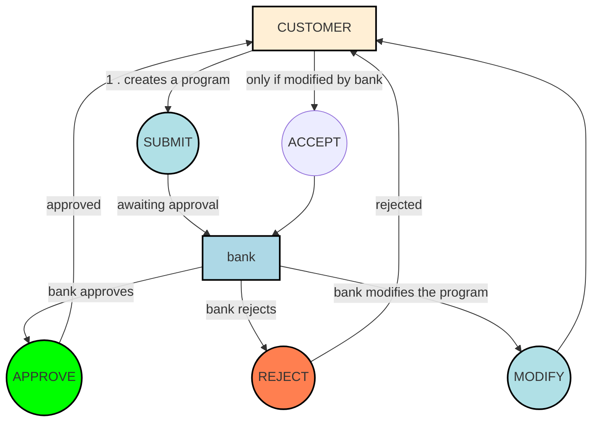
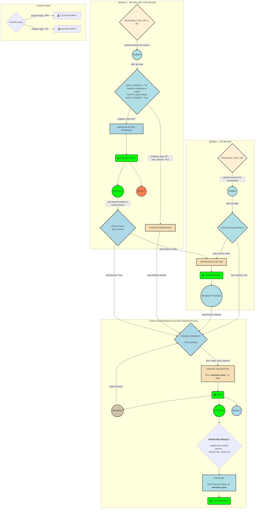
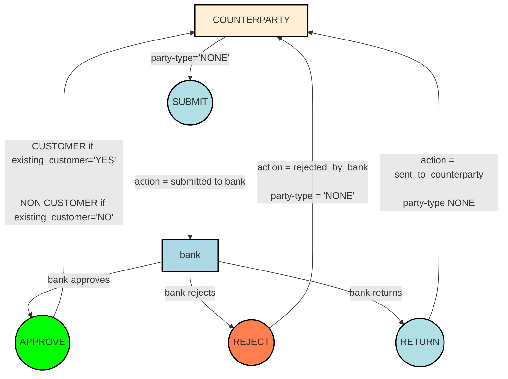

# **TRANSITION FLOWS FOR PROGRAM , INVOICES UPLOADS , INVOICES**

---
## 1. PROGRAM FLOW 
---

```mermaid
    graph TD
    G[CUSTOMER] --> |1 . creates a program| B((SUBMIT))
    B --> |awaiting approval| C[bank]
    C --> |bank approves| D((APPROVE))
    C --> |bank rejects| F((REJECT))
    C --> |bank modifies the program| H((MODIFY))
    H --> G
    G --> |only if modified by bank |N((ACCEPT))
    N --> C
    D --> |approved|G
    F --> |rejected| G

    style G fill:#FFEFD5, stroke:#000000, stroke-width:2px
    style B fill:#B0E0E6, stroke:#000000, stroke-width:2px
    style C fill:#ADD8E6, stroke:#000000, stroke-width:2px
    style D fill:#00ff00, stroke:#000000, stroke-width:2px
    style F fill:#FF7F50, stroke:#000000, stroke-width:2px
    style H fill:#B0E0E6, stroke:#000000, stroke-width:2px

      
```

## 2. INVOICE UPLOAD  AND FINANCE REQUESTS  FLOW 
---

``` mermaid
    flowchart TD

    subgraph Create Finance Request and Limit Checking Process
        A{FINANCE_REQUEST<br/><br/>limit checking}
        C[FINANCE REQUESTED<br/><br/>from: <strong>transition party</strong> , to: bank]
        D[FINANCED<br/><br/>from: finance module, to: <strong>transition party</strong>]
        E(fa:fa-university BANK) 
        F((RECHECK))
        G((APPROVE))
        H((REJECT))
        J{ <strong> FINANCING MODULE </strong> <br> <br> updates the interest amount , <br> interest rate , finance id }
        M(fa:fa-user COUNTERPARTY)
        
        %% Flows
        A -->|limit_check: fail or passed| C --> E
        E --> F & G & H
        F --> |bank rechecks|A
        G --> J --> D --> M
        
        
        %% Styles
        style A fill:#FFEFD5, stroke:#000000, stroke-width:2px
        style C fill:#F5DEB3, stroke:#000000, stroke-width:2px
        style D fill:#B0E0E6, stroke:#000000, stroke-width:2px
        style E fill:#00ff00, stroke:#000000, stroke-width:2px
        style F fill:#cfc4a7, stroke:#000000, stroke-width:2px
        style G fill:#00ff00, stroke:#000000, stroke-width:2px
        style H fill:#ADD8E6, stroke:#000000, stroke-width:2px
        style M fill:#00ff00, stroke:#000000, stroke-width:2px
    end

    subgraph MODEL 1 : APF BUYER
        
        A1{PROGRAM_TYPE: APF} --> |uploads invoices for counterparty| B1((SUBMIT))
        B1 --> |after last sign| C1{check pairing autofinance}
        C1 --> |auto_finance: false| D1[APPROVED BY BUYER]
        C1 --> |auto_finance: true| A
        D1 --> E1(fa:fa-user COUNTERPARTY)
        E1 --> F1((REQUEST FINANCE))
        F1 --> |raise finance request| A
        
        style A1 fill:#FFEFD5, stroke:#000000, stroke-width:2px
        style B1 fill:#B0E0E6, stroke:#000000, stroke-width:2px
        style C1 fill:#B0E0E6, stroke:#000000, stroke-width:2px
        style D1 fill:#F5DEB3, stroke:#000000, stroke-width:2px
        style A fill:#ADD8E6, stroke:#000000, stroke-width:2px
        style E1 fill:#00ff00, stroke:#000000, stroke-width:2px
        style F1 fill:#B0E0E6, stroke:#000000, stroke-width:2px
    end

    subgraph MODEL 2 : APF SELLER or RF SELLER
        
        A2{PROGRAM_TYPE: APF or RF} --> |uploads invoices for buyer's| B2((SUBMIT))
        B2 --> |after last sign| C2{AUTO_FINANCE = T/F, based on datasource values<br/>FOR RF_seller default AUTO_FINANCE = True}
        C2 --> |program_type: RF , auto_finance: True| D2[FINANCE REQUESTED]
        D2 --> |raise finance request| A
        C2 --> |program_type: APF | E2[AWAITING BUYER APPROVAL]
        E2 --> F2(fa:fa-user ANCHOR PARTY)
        F2 --> G2((APPROVE))
        F2 --> H2((REJECT))
        G2 --> |auto finance based on invoice record| I2{checks invoice auto_finance}
        I2 --> |auto finance: True| A
        I2 --> |auto finance: False| D1
        
        style A2 fill:#FFEFD5, stroke:#000000, stroke-width:2px
        style B2 fill:#B0E0E6, stroke:#000000, stroke-width:2px
        style C2 fill:#B0E0E6, stroke:#000000, stroke-width:2px
        style D2 fill:#F5DEB3, stroke:#000000, stroke-width:2px
        style E2 fill:#ADD8E6, stroke:#000000, stroke-width:2px
        style F2 fill:#00ff00, stroke:#000000, stroke-width:2px
        style G2 fill:#00ff00, stroke:#000000, stroke-width:2px
        style H2 fill:#FF7F50, stroke:#000000, stroke-width:2px
        style I2 fill:#ADD8E6, stroke:#000000, stroke-width:2px
    end

    subgraph transition party
       t1{transition party} --> |program type : APF| t2[ fa:fa-user  COUNTER PARTY]
       t1 --> |program type : RF| t3[fa:fa-user  ANCHOR PARTY]
    end
    
```

## 3.COUNTERPARTY ONBOARDING FLOW
---

```mermaid
flowchart TD

    A[COUNTERPARTY] -->|party-type='NONE'| B((SUBMIT))
    B --> |action = submitted to bank| C[bank]
    C --> |bank approves| D((APPROVE))
    C --> |bank rejects| F((REJECT))
    C --> |bank returns| E((RETURN))
    E --> |action = sent_to_counterparty<br/><br/>party-type NONE| A
    D --> |CUSTOMER if existing_customer='YES'<br/><br/><br/>NON CUSTOMER if existing_customer='NO'| A
    F --> |action = rejected_by_bank<br/><br/>party-type = 'NONE'| A

    style A fill:#FFEFD5, stroke:#000000, stroke-width:2px
    style B fill:#B0E0E6, stroke:#000000, stroke-width:2px
    style C fill:#ADD8E6, stroke:#000000, stroke-width:2px
    style D fill:#00ff00, stroke:#000000, stroke-width:2px
    style F fill:#FF7F50, stroke:#000000, stroke-width:2px
    style E fill:#B0E0E6, stroke:#000000, stroke-width:2px

```

